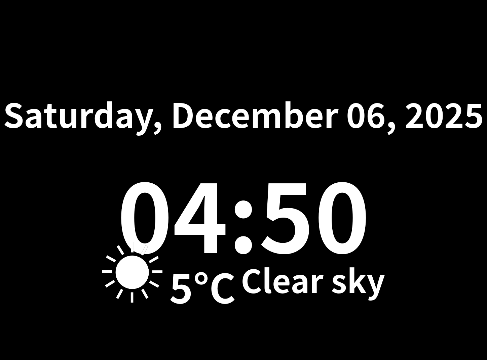

# SumiClock

A minimalist digital clock image generator optimized for e-paper displays (Kindle/Kobo).

## Features

- Clean layout with date, time, and optional weather information
- Support for both landscape and portrait display orientations
- Automatic dark mode switching based on time of day (light/dark themes)
- E-reader friendly grayscale images
- E-ink optimized weather icons with high contrast (based on the work from [Kindle Weather Display](https://mpetroff.net/2012/09/kindle-weather-display/))
- OpenWeatherMap integration for current weather conditions
- Timezone support
- Redis caching for efficient image serving
- Configurable through environment variables and config file



## Usage

SumiClock generates a simple clock image that can be used as a screensaver or wallpaper on e-paper displays. The image is served via a lightweight FastAPI web server.

### Quick Start

```bash
# Start the application with default settings
docker compose up -d

# Access the clock image
curl http://localhost:8000/clock.png > clock.png

# Access with specific orientation
curl http://localhost:8000/clock.png?orientation=landscape > landscape_clock.png
curl http://localhost:8000/clock.png?orientation=portrait > portrait_clock.png
```

### Using with E-readers

1. Run SumiClock on a server in your local network
2. Set up your e-reader to use the image URL as a screensaver/wallpaper
3. For automatic updating:
   - Kindle: Use a scheduled task with the experimental browser
   - Kobo: Use KSM (Kobo Start Menu) or other custom firmware

## Configuration

Configuration can be managed through both `config.yaml` and environment variables:

```yaml
redis:
  host: redis
  port: 6379
  cache_expire_seconds: 30

clock:
  timezone: "Asia/Tokyo"  # Any valid IANA timezone
  width: 1448            # Image width
  height: 1072          # Image height
  font_size: 200
  date_font_size: 100
  weather_font_size: 120
  font_path: /usr/share/fonts/opentype/noto/NotoSansCJK-Bold.ttc
  display_weather: false
  weather_api_key: ""
  weather_city: "Tokyo"
  weather_units: "metric"
  dark_mode_start: 18   # 6 PM
  dark_mode_end: 6     # 6 AM
  portrait_mode: false  # Set to true for vertical/portrait layout
  use_templates: true   # Use SVG templates for rendering
  template_dir: "./templates"  # Path to template directory
```

### Display Orientation

SumiClock supports both landscape (horizontal) and portrait (vertical) display orientations:

- **Landscape Mode**: Default orientation, optimized for wider displays
- **Portrait Mode**: Vertical orientation, optimized for taller displays like smartphones or vertically-mounted e-readers

There are two ways to specify the orientation:

#### 1. Configuration-based (Static)

Set your preferred default orientation in the configuration:

```yaml
clock:
  portrait_mode: true  # Enable portrait orientation
```

#### 2. API Parameter (Dynamic)

For dynamic orientation switching without changing the configuration, use the `orientation` query parameter:

```
http://localhost:8000/clock.png?orientation=landscape
http://localhost:8000/clock.png?orientation=portrait
```

This is useful for:
- Testing different orientations
- Supporting multiple devices with different orientations
- Rotating displays that might change orientation

The API parameter takes precedence over the configuration setting, allowing temporary orientation changes.

Example portrait mode configuration:
```yaml
clock:
  width: 1072          # Narrower width for portrait mode
  height: 1448        # Taller height for portrait mode
  portrait_mode: true  # Enable portrait orientation
```

### Environment Variables

All configuration options can be overridden using environment variables:

- `SUMICLOCK_REDIS_HOST`: Redis server hostname (default: "redis")
- `SUMICLOCK_REDIS_PORT`: Redis server port (default: 6379)
- `SUMICLOCK_REDIS_CACHE_EXPIRATION_SECONDS`: Cache expiration time in seconds (default: 30)
- `SUMICLOCK_TIMEZONE`: Clock timezone (default: "UTC")
- `SUMICLOCK_DISPLAY_WEATHER`: Enable weather display (default: false)
- `SUMICLOCK_WEATHER_API_KEY`: OpenWeatherMap API key
- `SUMICLOCK_WEATHER_CITY`: City for weather data (default: "Tokyo")
- `SUMICLOCK_WEATHER_UNITS`: Units for weather data (default: "metric")
- `SUMICLOCK_PORTRAIT_MODE`: Enable portrait orientation (default: false)
- `LOG_LEVEL`: Application log level (default: "INFO")

Example using environment variables:
```bash
docker compose up -d \
  -e SUMICLOCK_TIMEZONE=America/New_York \
  -e SUMICLOCK_DISPLAY_WEATHER=true \
  -e SUMICLOCK_WEATHER_API_KEY=your_api_key \
  -e SUMICLOCK_WEATHER_CITY=New_York \
  -e SUMICLOCK_PORTRAIT_MODE=true \
  -e LOG_LEVEL=DEBUG
```

## Weather Integration

SumiClock can display current weather conditions from OpenWeatherMap:

1. Sign up for a free API key at [OpenWeatherMap](https://openweathermap.org/api)
2. Set the `weather_api_key` in config.yaml or use the `SUMICLOCK_WEATHER_API_KEY` environment variable
3. Enable weather display with `display_weather: true` or `SUMICLOCK_DISPLAY_WEATHER=true`
4. Configure city and units as needed

### E-ink Optimized Weather Icons

SumiClock uses custom E-ink optimized weather icons that provide better contrast and readability on e-paper displays. These icons are:

- Automatically generated at startup if they don't exist
- Designed for high contrast and clear visibility on e-paper displays
- Simplified monochrome versions of standard weather icons
- Based on the approach from [Kindle Weather Display](https://mpetroff.net/2012/09/kindle-weather-display/)

The system will fall back to standard OpenWeatherMap icons if there's an issue with the local icons.

## Development

### Prerequisites

- Docker and Docker Compose
- Python 3.11+
- Poetry (optional)

### Running Tests

```bash
docker compose -f docker-compose.test.yml up --build test
```

### Testing Display Orientations

To preview how the clock looks in both landscape and portrait modes:

```bash
docker compose -f docker-compose.test.yml run orientation-test
```

This will generate both landscape and portrait clock images for comparison. Images will be saved to the `test_output` directory. Press Enter when you're finished viewing the images to clean them up.

### Layout Templates

SumiClock uses SVG templates for consistent rendering of clock layouts. You can find these templates in the `templates` directory:

- `landscape_template.svg`: Template for horizontal layout
- `portrait_template.svg`: Template for vertical layout

You can customize these templates to adjust the visual design without changing the code.

To generate fresh layout templates:

```bash
docker compose -f docker-compose.test.yml run layout-templates
```

### Local Development

1. Clone the repository
2. Install dependencies: `pip install -r requirements.txt`
3. Run the application: `python src/main.py`

## License

This project is licensed under the MIT License - see the [LICENSE](LICENSE) file for details.